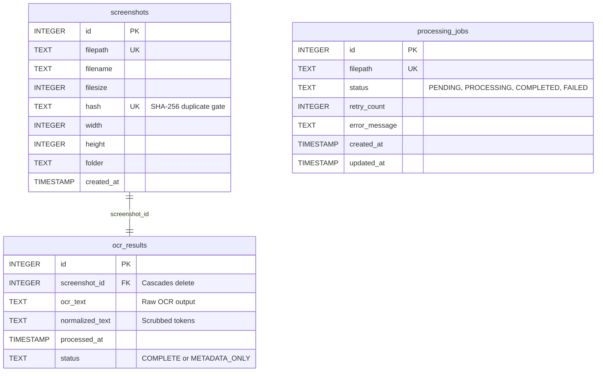
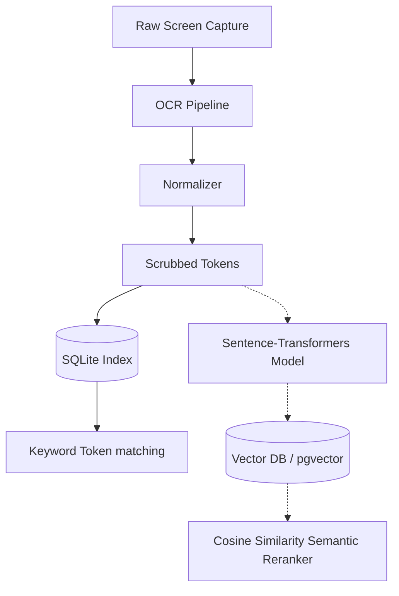

# ZapLink AI Memory Subsystem Architecture

This document defines the architecture, data layers, and design boundaries of the **ZapLink AI Memory Subsystem (Screenshot Intelligence System)**.

---

## 🏗️ Subsystem Folder Structure

The AI Memory layer is fully modularized and isolated under the `app/ai` directory to preserve the stability of the core file transfer services:

```
app/ai/
├── __init__.py            # Blueprint endpoints and manual mock boot loaders
├── services.py            # Lifecycle startup & shutdown orchestrator
├── database/
│   ├── db.py              # SQLite table initializers & WAL mode controls
│   └── repository.py      # SQLite CRUD, stats aggregation, & text queries
├── indexing/
│   └── watcher.py         # Thread-safe Singleton watchdog folder monitor
├── ocr/
│   ├── engine.py          # Pillow + pytesseract controller with fallback
│   └── normalizer.py      # Text preprocessing, scrubbing, & deduplication
└── search/
    └── engine.py          # Multi-token keyword sorting & recency ranking
```

---

## 🗄️ SQLite Database Schema & Quotas

The local storage uses a thread-safe SQLite database running in **Write-Ahead Logging (WAL) Mode** to guarantee high concurrent read/write throughput without blocking Flask workers.

### Database Tables:



### Storage Quota & Retention Policy
* **Index Limit**: Monitored and capped at **500 indexed screenshots** by default.
* **Prune Algorithm**: Upon registering a new screenshot, if the limit is exceeded, the **Retention Manager** (`retention/manager.py`) orders records by `created_at` ASC and deletes the oldest database records.
* **Disk Safety Policy**: To prevent user data loss, the retention manager **never** deletes physical image files from the Windows screenshots folder; it only prunes database index rows to limit DB footprint.
* **Orphan Cleanup**: Runs a periodic scan (every 60 seconds) checking `os.path.exists(filepath)` for each record. If an image was deleted by the user on their hard drive, the DB record is immediately purged, ensuring search results always point to active files.

---

## 📈 Future Semantic & Vector Extension Strategy

The codebase prepares interfaces and structure to seamlessly transition keyword searching into vector-based similarity matching:



1. **Embedding Generation Placeholder**: Under `app/ai/services.py`, the `generate_embeddings(text_content)` abstract method stands ready to ingest preprocessed strings and output 384-dimensional dense vectors.
2. **Hybrid Search Integration**: Once vector storage is introduced, search logic can query SQLite for high-precision metadata and token filters, while querying a local vector store (e.g. ChromaDB or SQLite-vec) for semantic matches, merging the results using Reciprocal Rank Fusion (RRF).
