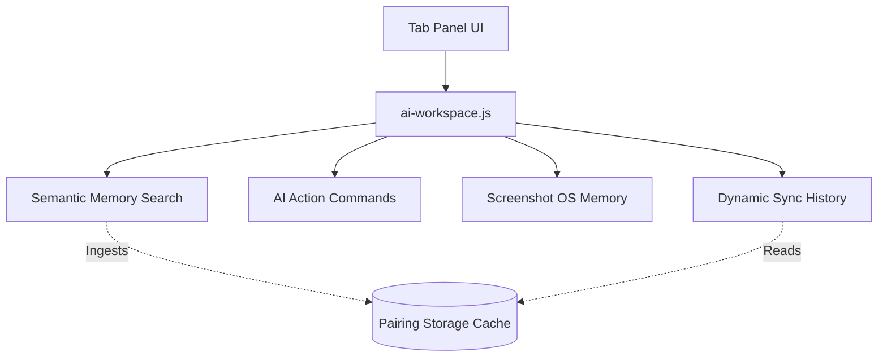

# ZapLink Frontend Architecture Specification

This document details the refactored, high-performance modular frontend architecture implemented for the ZapLink AI Workspace. The frontend is designed to be lightweight, production-grade, highly responsive, and scalable for future real-time communication (WebSockets) and local AI workspace enhancements.

---

## 🏗️ Directory Structure & Separation of Concerns

To improve maintainability, cacheability, and modularity, the monolithic inline blocks inside `index.html` have been broken down into structured, single-responsibility files under the Flask application's `/static` assets directory:

```
cloud_relay/app/static/
├── css/
│   └── styles.css              # Central styling system & layout design tokens
├── js/
│   ├── notifications.js        # Global Toast Alert framework
│   ├── pairing.js              # Deep-linking, QR pairing & session cache
│   ├── transfer.js             # Core upload/download transfer logic
│   └── app.js                  # Master application orchestrator & DOM events
└── components/
    └── ai-workspace.js         # Future AI Workspace UI component
```

### Component Responsibilities

1. **View Layer (`index.html`)**: Defines the semantic layout skeleton. Uses strict heading structures, standard accessibility attributes (`aria-selected`, `tabindex`), and unique IDs. Contains zero inline script blocks and zero inline styles.
2. **Styling System (`styles.css`)**: Maintains a curated dark mode palette with standardized HSL tokens, 4px grid spacing, responsive media queries (supporting screen dimensions down to 320px), and smooth interactive transition keyframes.
3. **Toast Alerts (`notifications.js`)**: A dependency-free framework exposing `window.Toast.show(message, type, duration)`. Includes automated listeners monitoring standard browser `online` and `offline` state handshakes.
4. **QR & Pairing (`pairing.js`)**: Generates scan-ready, deep-link pairing URLs. Resolves historical and active connections utilizing an ephemeral client-side cache in `localStorage`.
5. **Transfer Core (`transfer.js`)**: Decoupled asynchronous networking module. Manages XMLHttpRequests (direct S3 streams with upload fallback) and chunked stream readers (AbortController-capable downloads) without touching the DOM.
6. **Orchestrator (`app.js`)**: Bootstraps the application, binds DOM events, handles input validations, and maps callbacks from the Transfer logic to visual UI components.

---

## ⚡ Transfer Progress and Timing Calculations

ZapLink uses mathematical averages to calculate stable speeds and ETAs, avoiding jitter or erratic leaps during active streams.

### Speed Calculation (Bytes/Second)
Speed is tracked relative to the total duration of the active connection session, providing a smooth moving average:

$$\text{Speed} = \frac{\text{Bytes Loaded}}{\text{Elapsed Time in Seconds}}$$

```javascript
const timeElapsed = (Date.now() - startTime) / 1000;
const speed = loaded / (timeElapsed || 0.001); // Avoid division by zero
```

### ETA Remaining (Seconds)
Estimated Time of Arrival (ETA) utilizes the computed session average speed to project the remaining time:

$$\text{ETA} = \frac{\text{Bytes Remaining}}{\text{Speed}}$$

```javascript
const remaining = total - loaded;
const eta = speed > 0 ? remaining / speed : 0;
```

### Modes of Transfer
1. **Direct Stream (MinIO/S3)**: Streams raw binary buffers directly to target S3 storage using pre-signed upload URLs and strict HTTP PUT headers to avoid Flask server memory exhaustion.
2. **Relay Fallback (Flask)**: Instantly intercepts S3 signature mismatches or network drops, falling back to chunked multi-part form uploads routed through standard Flask worker disks.

---

## 🧠 Future AI Workspace Scalability & Integration

ZapLink prepared the user interface for integration with the future AI Workspace by separating visual rendering from intelligence components.



### Integration Plan:
* **Screenshot Memory**: When the native client (Android/PC) triggers background captures, they are streamed to the object storage using the exact same pre-signed transfer protocols. The web layout is ready to fetch these media thumbnails and render them in the visual grids.
* **Semantic Search**: The UI text input is wired to a simulated vector embedding search. In production, typing in the search box will trigger POST requests to `/ai/search` containing the user query, and return structured context matches which are then rendered dynamically in the results card.
* **AI Action Commands**: Pills trigger lightweight instructions like `/ocr` or `/summarize`. In the future, these command strings will be parsed in the orchestrator and mapped to standard REST API endpoints.
