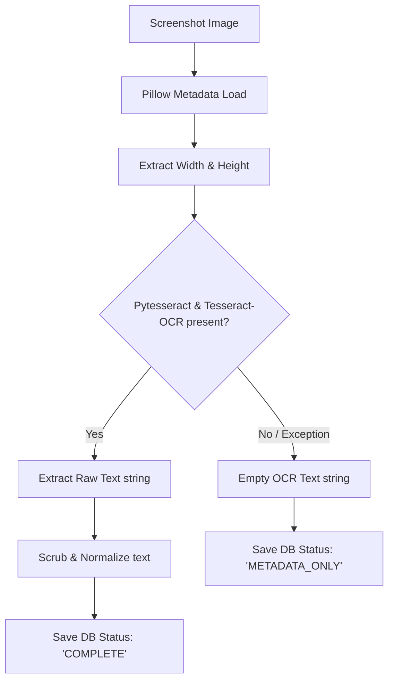

# ZapLink OCR Ingestion & Sanitization Pipeline

This document defines the image preprocessing, text extraction, failure recovery, and text normalization specifications for the ZapLink AI Memory subsystem.

---

## ⚙️ Ingestion & OCR Processing

The pipeline extracts structural metadata (dimensions) and processes images through local Tesseract-OCR wrappers.



---

## 🛟 Metadata-Only Fallback Policy

To ensure high reliability for solo-developer test cycles and deployment environments where external binary dependencies are missing:
* **Exceptions Handled**: If `pytesseract` is missing from python packages or if `tesseract` binary is not configured on the operating system host PATH, the engine catches the exception.
* **No Fabrications**: Rather than generating fake mockup OCR strings, the pipeline registers an empty text string, marks the database entry as `METADATA_ONLY`, and preserves all original image headers:
  * Filename (e.g. `react_auth_error.png`)
  * Original File Size (e.g. `142 KB`)
  * Date Created (e.g. `May 28, 2026`)
  * Width & Height (e.g. `1920x1080` pixels)
  * Target Folder (e.g. `Screenshots`)
* **Visible Transparency**: The frontend reads the `ocr_status` and renders yellow labels displaying **"Metadata Only"**, maintaining system integrity and user trust.

---

## 🧹 Text Normalization Layer (`normalizer.py`)

Raw text extracted from screens contains formatting noise, stray punctuation, and repeat tokens. Before database indexing, the text is run through a multi-stage sanitizer:

```
  "TypeError: Cannot read properties of null (reading 'useContext') ..."
                                 ↓
                    [ 1. Lowercase conversion ]
  "typeerror: cannot read properties of null (reading 'usecontext') ..."
                                 ↓
                 [ 2. Whitespace Normalization ]
  "typeerror: cannot read properties of null (reading 'usecontext') ..."
                                 ↓
                     [ 3. Symbol scrubbing ]
  "typeerror cannot read properties of null reading usecontext"
                                 ↓
                  [ 4. Token duplicate removal ]
  "typeerror cannot read properties of null reading usecontext" (deduplicated)
```

### Steps:
1. **Lowercase Standardization**: Standardizes all characters to lowercase to enable case-insensitive indexing.
2. **Whitespace Compaction**: Compiles tabs, linebreaks, and double spaces into clean single spaces.
3. **Symbol Scrubbing**: Strips isolated punctuation symbols (`|`, `~`, `_`, `\`) that result from OCR scanning glitches while keeping alphanumeric tokens.
4. **Token Deduplication**: Splices the string into words and removes duplicates, reducing index memory size and boosting SQLite matching speeds.
