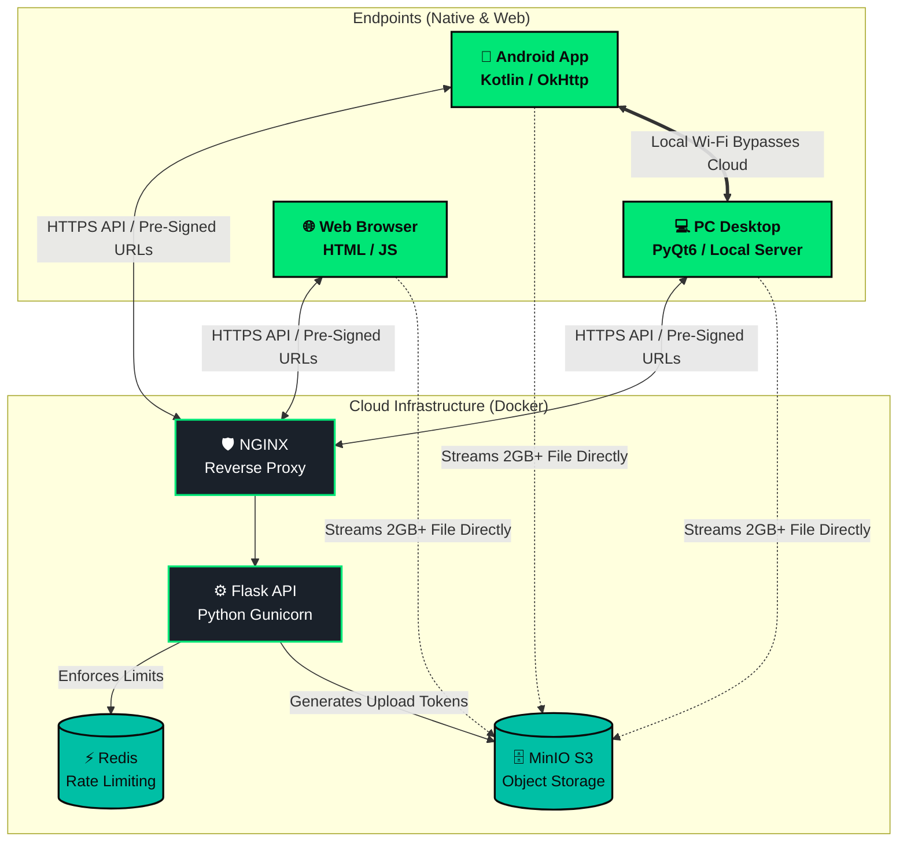

# ⚡ ZapLink
**The Frictionless, Cross-Platform File Transfer Ecosystem**

ZapLink is a high-performance, completely anonymous file-transfer architecture designed to seamlessly bridge Android devices and PC Desktops without the need for accounts, cables, or storage limits. 

It was built from the ground up to solve the friction of modern file sharing by entirely bypassing email attachment limits, WhatsApp image compression, and Google Drive storage caps.

---

### 🚀 Key Features

*   **Frictionless 6-Digit Pairing:** Select a file, receive a 6-digit PIN, and type it into the receiving device. The transfer begins instantly. No accounts, no emails, no passwords.
*   **Zero Compression:** Files and photos are transferred bit-for-bit in their absolute original, native quality.
*   **Direct Local Wi-Fi Mode (PC):** If devices are on the same router, the desktop application bypasses the internet entirely, utilizing raw gigabit intranet speeds to transfer massive files (10GB+) in seconds.
*   **Secure & Ephemeral (Cloud):** The cloud relay infrastructure utilizes MinIO object storage to host encrypted payloads. The exact millisecond a receiver successfully downloads a file, it is permanently wiped from the servers. 
*   **Strict 2GB Payload Guardrails:** Production-hardened with native pre-flight payload validation across all interfaces (Android UI, Web DOM, and Flask backend) to prevent server memory exhaustion.

---

### 🏗️ Architecture & Tech Stack

ZapLink is a unified ecosystem composed of three distinct master applications:

1.  **The Cloud API (`/cloud_relay`)**
    *   *Stack:* Python, Flask, Redis, MinIO, Docker, NGINX.
    *   *Role:* The global internet bridge. Issues pre-signed S3 URLs so clients can stream data directly to the MinIO database bucket, bypassing Flask worker memory limits. Redis handles global rate-limiting to prevent DDoS attacks.
2.  **The Native Android App (`/p2w_local/android_app`)**
    *   *Stack:* Kotlin, Android Studio, OkHttp.
    *   *Role:* A premium, Material-Design interface featuring a DayNight theme. It utilizes custom BroadcastReceivers to handle massive background uploads and downloads natively without freezing the UI thread.
3.  **The PC Desktop Client (`/pc_client`)**
    *   *Stack:* Python, PyQt6, QWebEngine.
    *   *Role:* An "All-In-One" desktop executable that securely embeds the cloud website while simultaneously running a local multithreaded HTTP Wi-Fi server for instantaneous offline transfers.

---

### ⚖️ Legal & Copyright
**© 2026 Mayank. All Rights Reserved.**

This repository is showcased exclusively as a technical portfolio piece to demonstrate architectural design, full-stack engineering, and production hardening. 

*   **Code theft is strictly prohibited.** You may not clone, deploy, commercialize, or claim this project architecture as your own work. 
*   If you are a recruiter or engineer, you are welcome to review the code to evaluate the technical implementations!
