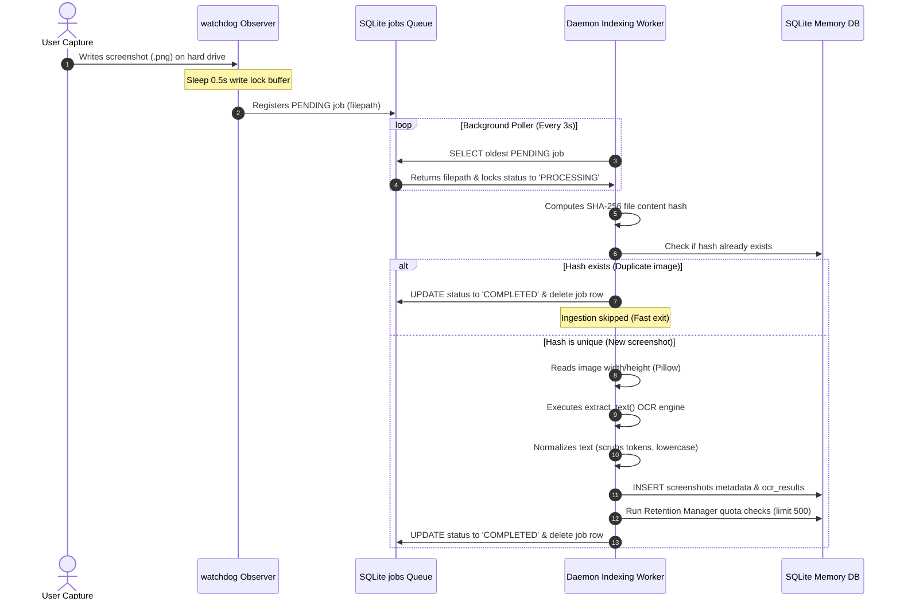

# ZapLink Screenshot Watcher & Indexing Flow

This document details the background filesystem monitoring, atomic queue state changes, write-lock guards, and Singleton lifecycle controls implemented in the ZapLink AI Memory subsystem.

---

## 🗺️ Indexing Ingestion Lifecycle



---

## 🔒 Write-Lock & File Stability Guard

During active desktop screenshot capture events, operating system disk write buffers can trigger watchdog creation callbacks before the image file is fully written on hard disk. 
To prevent hashing corrupt or partial binaries:
1. **Time Delay**: Watchdog catches `on_created` and sleeps for `0.5 seconds` to let the OS complete the file write block.
2. **Hash Validation**: The background poller opens the stabilized file, computes its SHA-256 hash, and compares it against the database. If a duplicate exists (e.g., repeating the same image file name or copy operations), the task is immediately marked as completed and removed, eliminating duplicate entries.

---

## 🦄 Singleton Daemon & Safe Reloader Boots

Flask's local reloader (`werkzeug`) boots the application stack double-times during standard debug executions (one parent reloader process monitoring file edits, one active child worker executing Flask endpoints). 
To prevent launching double duplicate observer threads and resource lock conflicts:
* **Reloader Check**: The subsystem watcher (`watcher.py`) checks if `WERKZEUG_RUN_MAIN` is set. It suppresses thread start operations if the reloader thread is not fully booted.
* **Lock Guard**: A thread safety lock (`_watcher_lock`) validates state indicators and active observers, ensuring only one instance of the background thread starts:

```python
with _watcher_lock:
    if _active_observer is not None or _queue_thread is not None:
        # Already active, skip startup
        return
```
* **Graceful Exit**: On shutdown, the thread-safe `stop_screenshot_watcher()` stops the watchdog observer, joins running threads, and clears memory pointer allocations.
