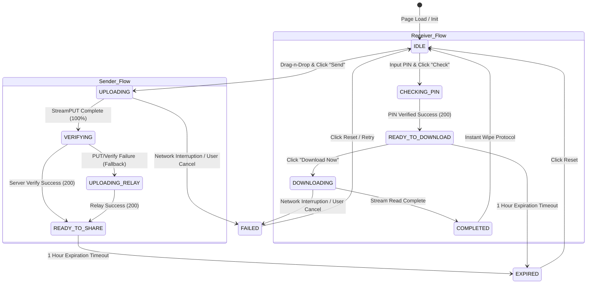

# ZapLink Frontend UI State Flow Specification

This document defines the lifecycle states, state transitions, and user experience visual representation specifications for the ZapLink file transfer client application.

---

## 🗺️ State Transition Matrix

The frontend lifecycle handles separate paths for the **Sender** and **Receiver** devices, transitioning from initial inputs to final secure wipes.

---

## 🎨 Visual Presentation & Accessibility Details

Standard HSL semantic colors, micro-animations, and typographic changes are mapped to each specific transfer state to provide clear visual cues to the user.

| Transfer State | Primary Visual Color | Visual Indicators | CSS Transition / Animation | User-facing Feedback Message |
| :--- | :--- | :--- | :--- | :--- |
| **IDLE** | Border: `#2c2c32` | Standard drop-zone area, action buttons disabled by default. | Interactive hover scaling and transition. | "Click to browse or drag & drop files here." |
| **UPLOADING** | Gradient: `#00E676` to `#00BFA5` | Glowing progress bar, real-time speed, elapsed ETA. | Active progress bar linear fill width transition. | "Uploading via Direct S3 Stream (Percentage %)" |
| **VERIFYING** | Secondary: `#0a84ff` (Blue) | Loading text, cancel buttons hidden, scanning spinner. | Soft pulse skeleton transition. | "Verifying upload integrity with server..." |
| **READY_TO_SHARE** | Accent: `#00E676` (Green) | Solid green border, 6-digit PIN display, QR Code card. | Soft scaleUp entrance animation. | "Upload complete! Share this PIN." |
| **CHECKING_PIN** | Info: `#0a84ff` (Blue) | Disabled PIN input field, progress indicator. | Shimmer loading loader transition. | "Checking PIN status with server..." |
| **READY_TO_DOWNLOAD**| Accent: `#30D158` (iOS Green) | High-contrast card, filename text display, download button. | Elegant slideDown entry animation. | "File ready for extraction: [filename]" |
| **DOWNLOADING** | Gradient: `#00E676` to `#00BFA5` | Real-time progress bar, speed tracker, active cancels. | Linear width width calculations. | "Downloading chunked buffers (Percentage %)" |
| **COMPLETED** | Success: `#30D158` (Green) | High contrast alert box, Toast success confirmation. | scaleUp confirmation animation. | "Saved to Downloads!" |
| **EXPIRED** | Warning: `#ff9f0a` (Orange) | Yellow warning border status alert. | fadeIn animation. | "The PIN has expired or was not found." |
| **FAILED** | Danger: `#ff453a` (Red) | High-contrast red alert box, Toast error popup. | Soft pulse alert keyframe. | "Upload failed: [Error Reason]" |

---

## ⚡ Accessibility-Conscious Design Standards

* **Keyboard Navigation**: Drop zones are accessible via keyboard focus (`tabindex="0"`) and trigger standard browsing options using keyboard inputs.
* **Color Independence**: Status messages never rely solely on color changes. Detailed visual indicators are accompanied by explicit text labels (e.g., using prefix symbols like "✅ Success", "❌ Error", "⏳ Waiting").
* **Screen Reader Integrity**: Dialogs, focus zones, progress bar states, and alerts are mapped with semantic aria-labels to maintain layout integrity.
